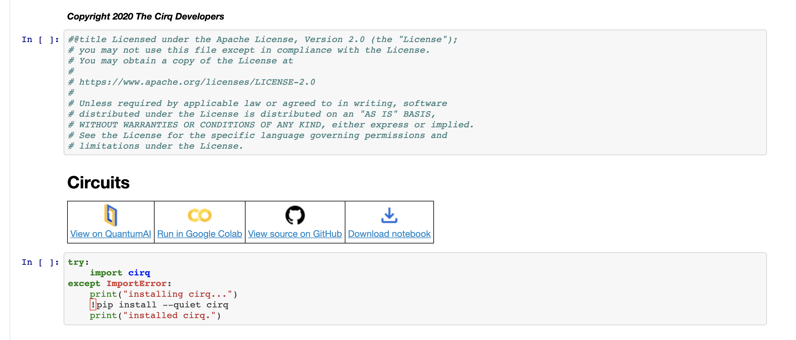

# Notebooks guidelines 

Our guides and tutorials are frequently written using iPython Notebooks. The notebooks require specific formatting, are continuously tested (when possible) and we have a specific process to manage the lifecycle of a notebook before and after a Cirq release.    

## Formatting 

Formatting is easy, the script `check/nbformat` should tell you if your notebooks are formatted or not.
You can apply the changes in one go with `check/nbformat --apply`. It is recommended to add this to your [git pre-commit hook](https://git-scm.com/book/en/v2/Customizing-Git-Git-Hooks), to save feedback time and CI resources. 

## Output cells 

Output cells typically should not be saved in the notebook. They will be generated for the final site.
The exception to this rule are notebooks with external dependencies ([see below](#notebooks-with-external-dependencies)). 

## Header

We also expect a standard header to be included in all of our notebooks: 
- the links to colab, github and the main site ([quantumai.google/cirq](https://quantumai.google/cirq))
- optional package installation (you can assume Colab dependencies exist)

Example header:

You can use [our template notebook](https://storage.googleapis.com/tensorflow_docs/Cirq/docs/_template.ipynb) to get started - please remember to change the `$$$REPLACE_WITH_TITLE$$$`, `$$$REPLACE_WITH_SITE_URL$$$` and `$$$REPLACE_WITH_NOTEBOOK_PATH$$$` placeholders.

## Editing the tree nav on the site: _book.yaml

If you are placing a guide or a tutorial on the site, please make sure you add an entry to the right place in the nav tree in [docs/_book.yaml](https://github.com/quantumlib/Cirq/blob/master/docs/_book.yaml).

## Testing 

Those notebooks that don't have any external dependencies (e.g. API calls, authentication) are tested on a continuous basis. 
See the [`dev_tools/notebooks`](https://github.com/quantumlib/Cirq/tree/master/dev_tools/notebooks) directory for the two tests: 
- [notebook_test.py](https://github.com/quantumlib/Cirq/blob/master/dev_tools/notebooks/notebook_test.py) - to test notebooks against the current branch
- [isolated_notebook_test.py](https://github.com/quantumlib/Cirq/blob/master/dev_tools/notebooks/isolated_notebook_test.py) - to test notebooks against the latest released version of Cirq

## Notebooks with external dependencies 

Unfortunately we have no easy way to test notebooks with external API dependencies, e.g. cirq.google's Engine API. 
These notebooks should be excluded from both tests. 

The site that generates the outputs for notebooks also can't handle external dependencies. 

Thus, for notebooks with external dependencies, **all cells must have their outputs saved in the notebook file**. This ensures that the site pipeline will skip these notebooks.  

## Lifecycle 

You should configure notebooks differently depending on whether they rely on features in the pre-release build of cirq or not. 

### Pre-release notebooks

When you introduce a notebook that depends on pre-release features of Cirq, make sure to 
 
 - mark the notebook at the top that `Note: this notebook relies on unreleased Cirq features. If you want to try these feature, make sure you install cirq via pip install cirq --pre`. 
 - use `pip install cirq —pre`  in the installation instructions 
 - make sure dev_tools/notebooks/test_notebooks.py covers the notebook 
 - exclude the notebook from the dev_tools/notebooks/isolated_notebook_test.py by adding it to `NOTEBOOKS_DEPENDING_ON_UNRELEASED_FEATURES`

### Stable notebooks

When you introduce a notebook that only uses already released features of Cirq, make sure to
 - use `pip install cirq` (NOT `pip install cirq --pre`)
 - do not exclude the notebook from dev_tools/notebooks/isolated_notebook_test.py (except if the notebook has external dependencies)
 - do not exclude the notebook dev_tools/notebooks/notebook_test.py (except if the notebook has external dependencies)

### Release 

At release time, we change all the **pre-release notebooks** in bulk: 
 - remove the pre-release notices
 - change `pip install cirq —pre` to `pip install cirq`
 - remove the exclusions in dev_tools/notebooks/isolated_notebook_test.py by making `NOTEBOOKS_DEPENDING_ON_UNRELEASED_FEATURES=[]`
 
As all the notebooks have been tested continuously up to this point, the release notebook PR should pass without issues. 

### Modifying stable notebooks 
 
Modifications to stable notebooks are tested with dev_tools/notebooks/isolated_notebook_test.py.
However, a stable notebook will become a pre-release notebook if a modification introduces dependency on unreleased features. In this case, follow the pre-release notebook guidelines accordingly. 